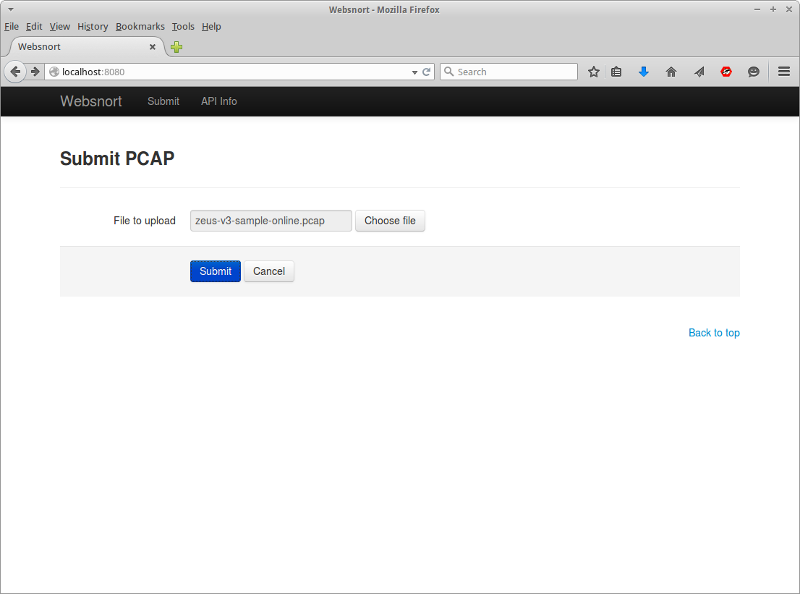
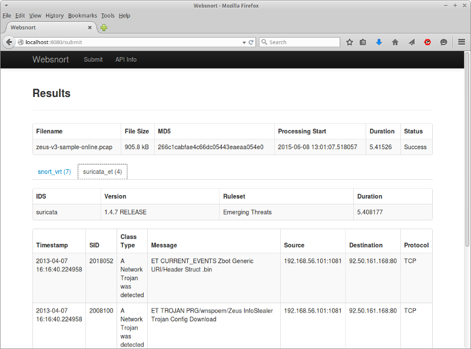

=====
Usage
=====

Interactive
-----------

Use a web browser and navigate to the address the `websnort` webserver
is listening on.  In these examples, the default http://localhost:8080.

Simply select a pcap file for analysis and choose *Submit*.

|web_submit|

If the server's configuration is correct, in a few seconds you should
see the results of any alerts returned.

|web_results| 

Tabs are presented for each IDS configuration that was executed.
A summary count of any produced alerts is visible in the tabs' labels.

Web API
-------

The same functionality is exposed via a json web api.
Full details of the api can be found by navigating to 
http://localhost:8080/api.

To submit a pcap file for analysis, perform a HTTP multipart form POST to 
http://localhost:8080/api/submit.  For example, using curl::
	
	$ curl -i --form file=@zeus-sample.pcap http://localhost:8080/api/submit
	HTTP/1.1 100 Continue
	
	HTTP/1.1 200 OK
	Content-Length: 5830
	Content-Type: application/json
	Date: Mon, 08 Jun 2015 03:18:42 GMT
	
	{
	    "status": "Success", 
	    "errors": [], 
	    "apiversion": "0.5", 
	    "filename": "zeus-v3-sample-online.pcap", 
	    "start": "2015-06-08T13:18:37.839617", 
	    "filesize": 905847, 
	    "duration": 4.645783, 
	    "analyses": [
	        {
	            "status": "Success", 
	            "name": "snort_vrt", 
	            "alerts": [
	                {
	                    "source": "157.56.134.98:80", 
	                    "classtype": "Misc activity", 
	                    "protocol": "TCP", 
	                    "sid": 2925, 
	                    "timestamp": "2013-04-07T16:17:13.136263", 
	                    "message": "INFO web bug 0x0 gif attempt", 
	                    "destination": "192.168.56.101:1089", 
	                    "revision": 3
	                }, 
	                {
	                    "source": "65.55.253.27:80", 
	                    "classtype": "Misc activity", 
	                    "protocol": "TCP", 
	                    "sid": 2925, 
	                    "timestamp": "2013-04-07T16:17:13.137856", 
	                    "message": "INFO web bug 0x0 gif attempt", 
	                    "destination": "192.168.56.101:1087", 
	                    "revision": 3
	                }, 
	                {
	                    "source": "65.55.239.146:80", 
	                    "classtype": "Misc activity", 
	                    "protocol": "TCP", 
	                    "sid": 2925, 
	                    "timestamp": "2013-04-07T16:17:13.636785", 
	                    "message": "INFO web bug 0x0 gif attempt", 
	                    "destination": "192.168.56.101:1091", 
	                    "revision": 3
	                }, 
	                {
	                    "source": "54.243.113.202:80", 
	                    "classtype": "Misc activity", 
	                    "protocol": "TCP", 
	                    "sid": 2925, 
	                    "timestamp": "2013-04-07T16:17:14.672190", 
	                    "message": "INFO web bug 0x0 gif attempt", 
	                    "destination": "192.168.56.101:1098", 
	                    "revision": 3
	                }, 
	                {
	                    "source": "65.55.253.27:80", 
	                    "classtype": "Misc activity", 
	                    "protocol": "TCP", 
	                    "sid": 2925, 
	                    "timestamp": "2013-04-07T16:17:15.785273", 
	                    "message": "INFO web bug 0x0 gif attempt", 
	                    "destination": "192.168.56.101:1087", 
	                    "revision": 3
	                }, 
	                {
	                    "source": "65.55.253.27:80", 
	                    "classtype": "Misc activity", 
	                    "protocol": "TCP", 
	                    "sid": 2925, 
	                    "timestamp": "2013-04-07T16:17:17.926444", 
	                    "message": "INFO web bug 0x0 gif attempt", 
	                    "destination": "192.168.56.101:1087", 
	                    "revision": 3
	                }, 
	                {
	                    "source": "65.55.253.27:80", 
	                    "classtype": "Misc activity", 
	                    "protocol": "TCP", 
	                    "sid": 2925, 
	                    "timestamp": "2013-04-07T16:17:22.333182", 
	                    "message": "INFO web bug 0x0 gif attempt", 
	                    "destination": "192.168.56.101:1119", 
	                    "revision": 3
	                }
	            ], 
	            "module": "snort", 
	            "version": "2.9.6.0 GRE (Build 47)", 
	            "ruleset": "Sourcefire VRT", 
	            "duration": 2.11351
	        }, 
	        {
	            "status": "Success", 
	            "name": "suricata_et", 
	            "alerts": [
	                {
	                    "source": "192.168.56.101:1081", 
	                    "classtype": "A Network Trojan was detected", 
	                    "protocol": "TCP", 
	                    "sid": 2018052, 
	                    "timestamp": "2013-04-07T16:16:40.224958", 
	                    "message": "ET CURRENT_EVENTS Zbot Generic URI/Header Struct .bin", 
	                    "destination": "92.50.161.168:80", 
	                    "revision": 4
	                }, 
	                {
	                    "source": "192.168.56.101:1081", 
	                    "classtype": "A Network Trojan was detected", 
	                    "protocol": "TCP", 
	                    "sid": 2008100, 
	                    "timestamp": "2013-04-07T16:16:40.224958", 
	                    "message": "ET TROJAN PRG/wnspoem/Zeus InfoStealer Trojan Config Download", 
	                    "destination": "92.50.161.168:80", 
	                    "revision": 11
	                }, 
	                {
	                    "source": "192.168.56.101:1120", 
	                    "classtype": "A Network Trojan was detected", 
	                    "protocol": "TCP", 
	                    "sid": 2018052, 
	                    "timestamp": "2013-04-07T16:17:41.235349", 
	                    "message": "ET CURRENT_EVENTS Zbot Generic URI/Header Struct .bin", 
	                    "destination": "92.50.161.168:80", 
	                    "revision": 4
	                }, 
	                {
	                    "source": "192.168.56.101:1120", 
	                    "classtype": "A Network Trojan was detected", 
	                    "protocol": "TCP", 
	                    "sid": 2008100, 
	                    "timestamp": "2013-04-07T16:17:41.235349", 
	                    "message": "ET TROJAN PRG/wnspoem/Zeus InfoStealer Trojan Config Download", 
	                    "destination": "92.50.161.168:80", 
	                    "revision": 11
	                }
	            ], 
	            "module": "suricata", 
	            "version": "1.4.7 RELEASE", 
	            "ruleset": "Emerging Threats", 
	            "duration": 4.639412
	        }
	    ], 
	    "md5": "266c1cabfae4c66dc05443eaeaa054e0"
	}

